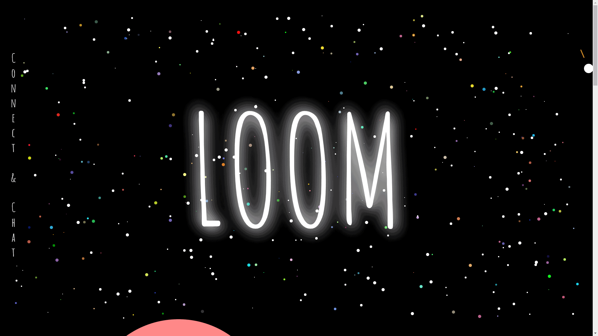

# Loom
Invite people to a Videochat!
    Or play Battleship LOOMactica!

This project is not finished yet!

## Description:
Invite your friends to join a meeting. 
Features: Videochat, Chat, Whiteboard!
You can send an invitation email to your friend for this chatroom, or just send the link to this chat session.
You can of course see who is online, can switch on/off the camera, mute your microphone, draw or paint on the Whiteboard. Supports touchscreens!
P2P-Communication with WebRTC and Signaling with socket.IO .
Until now it is only possible to have a videochat with 2 people.

- WebRTC: P2P, Video/Audio mute, STUN Server (loom/src/VideoApp.js)

- Whiteboard-tools: pencil, rectangle, circle, rubber, clear Canvas, set a drawing color, set backgroundcolor, set width/height, download image, scroll button for touchscreens

- Background-Canvas : Stars appear randomly, stars connect to mouse, more stars shine on when mouse moves

Still missing: Game LOOMactica!

## PREVIEW

## Tech Stack:
- React + Redux
- WebRTC
- Node.js
- Socket.io
- Express
- PostgreSQL
- Cookie-Session
- Javascript / HTML CANVAS